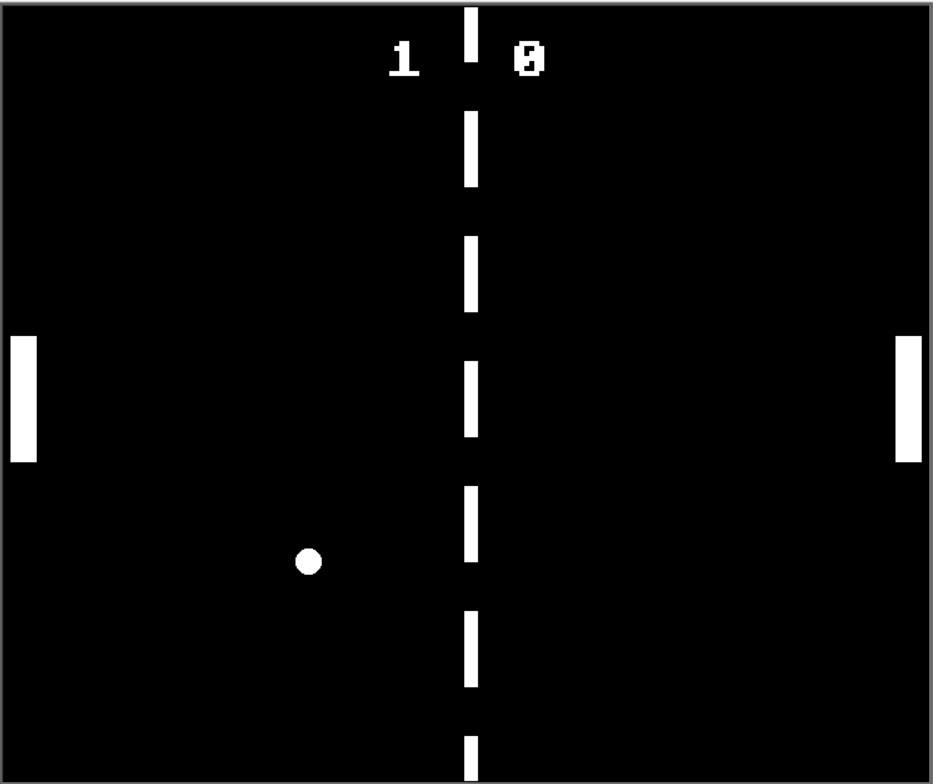

# Retro Pong

A simple Pong game built using Python's `turtle` module. This project follows Object-Oriented Programming principles and features smooth gameplay with a functional scoreboard.

## Demo


## How to Play
- Player 1 (Left Paddle):
  - **Move Up**: `W`
  - **Move Down**: `S`
- Player 2 (Right Paddle):
  - **Move Up**: `Up Arrow`
  - **Move Down**: `Down Arrow`

## Features
✅ Smooth paddle and ball movement  
✅ Score tracking system  
✅ Simple AI logic for autonomous paddle (optional)  
✅ Classic Pong gameplay experience  

## Installation & Running the Game
1. **Clone the repository:**
   ```bash
   git clone https://github.com/NomadBeetle/Retro-Pong.git
   cd Retro-Pong
   ```
2. **Run the game:**
   ```bash
   python main.py
   ```

## File Structure
- `main.py` - Runs the game loop and initializes objects
- `bar.py` - Defines paddle behavior
- `ball.py` - Controls ball movement and physics
- `scoreboard.py` - Handles scoring system

## Future Improvements
- Add sound effects
- Implement difficulty levels
- Improve AI paddle behavior
